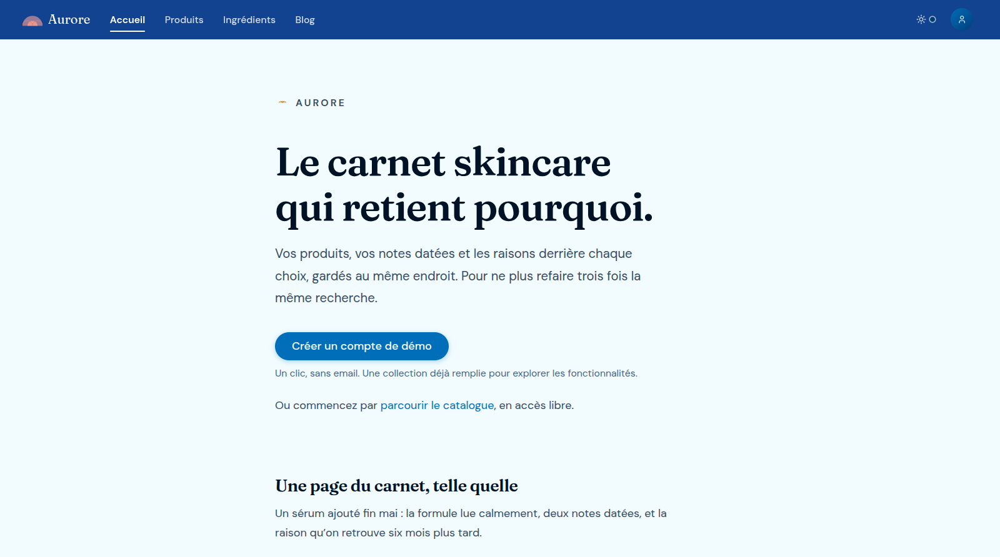
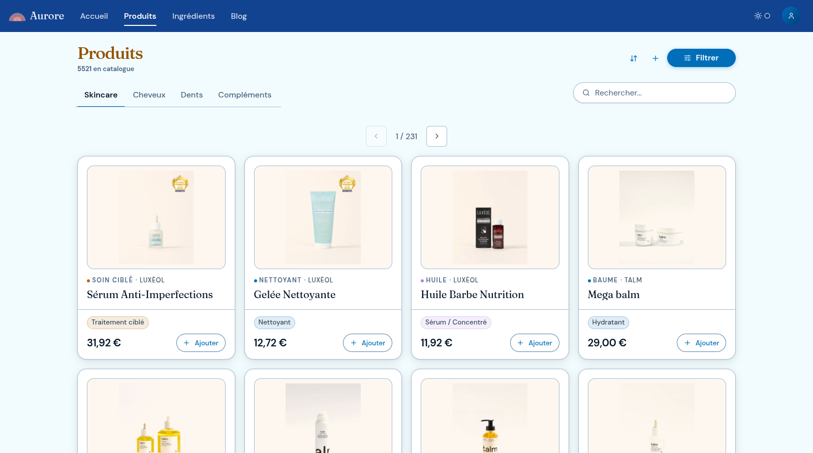
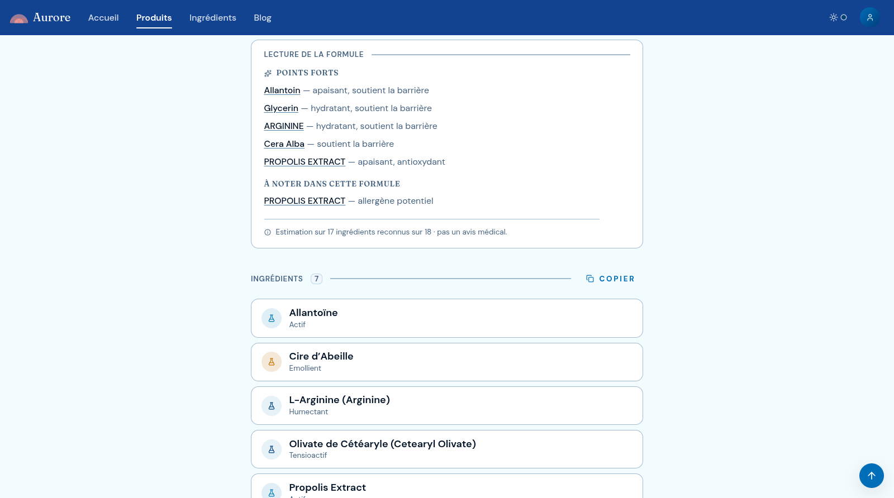
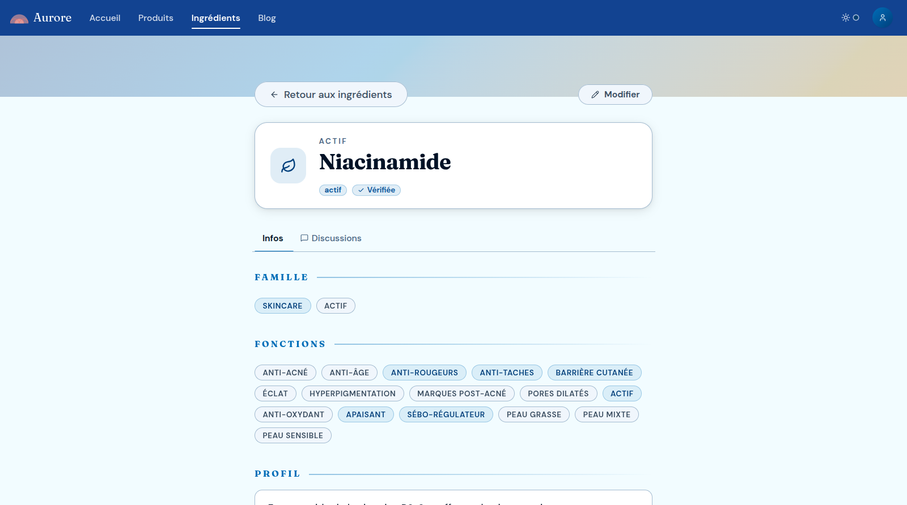

# Aurore

**Aurore is a skincare notebook.** Track products you own, want, or ruled out: INCI list, dated
notes, the reason behind each decision. The point: never redo the same research twice.

Not a medical tool. No score, no verdict, never tells anyone what to buy.

**[Live demo → aurore-app.fr](https://aurore-app.fr)**. Open beta, French interface. One click
creates a demo account: no email, no form, a collection already filled in.



---

## The loop

```text
browse the catalogue → read the formula → put the product on your shelf
→ write what happened → decide, and keep the reason
```

Five shelf states, because "no" is information too:

| State | Meaning |
| :--- | :--- |
| En stock | You own it, it is in use |
| Wishlist | Not bought yet, you intend to |
| Garde un œil | Bookmarked, no commitment |
| Archivé | Finished, or set aside |
| À éviter | Rejected. The note says why, so the research is not repeated |

---

## What Aurore does

**Catalogue**: public, no account. 7 300 products from 267 brands: 5 500 skincare, the rest hair,
oral care and supplements, with INCI lists parsed into 1 000 linked ingredients. A product page
reads the formula ingredient by ingredient, with tags, brand and discussion threads; an ingredient
page gives its role, its family and the products that contain it. Search and filters cover the
whole catalogue. Anyone signed in can submit a missing product or ingredient and suggest edits; a
moderation queue reviews them.

**Your shelf**: with an account.

- Dated notes and a quick sentiment on each product. "Saint Graal" is the top sentiment, not a
  sixth state.
- Purchases: price paid, opening and finishing dates, expiry. What a product actually costs you.
- Comparison: 2 to 8 products side by side, formula against formula, saved and reopenable.
- Motifs: what the formulas already on your shelf have in common, as recurring signals. Never a
  ranking.
- Skin profile: goals (redness, hyperpigmentation, ageing, acne) and sensitivity. It changes what
  is highlighted while reading a formula. A declared preference ("I avoid X") can hide a product,
  but the masking stays visible and reversible in one tap.
- Public profile page and a feed, for people who want to share their shelf.

**Around it**: blog written in-app by the maintainers, full data export, account deletion, no
third-party tracker.

---

## Formula reading

Derived from each product's INCI list: possible benefits, points worth knowing, and a confidence
level that drops when ingredients are unknown. Not a diagnosis, not a recommendation, not a safety
score.

The logic lives in [`algo-derm`](./vendor), a separate MIT library vendored as a backend
tarball. The browser only ever receives the final `ProductAssessment`, never the ingredient
dataset. Contract, confidence model and limits: [`docs/scoring.md`](./docs/scoring.md).

---

## Screenshots

|                                        Catalogue                                         |                                             Formula reading                                              |                                         Ingredient reference                                          |
| :--------------------------------------------------------------------------------------: | :------------------------------------------------------------------------------------------------------: | :---------------------------------------------------------------------------------------------------: |
| [](./docs/screenshots/02-catalogue.png) | [](./docs/screenshots/03-product-detail.png) | [](./docs/screenshots/04-ingredient.png) |

---

## Stack

Full-stack TypeScript on Bun, end-to-end typed without codegen: the backend exports its `AppType`,
the frontend consumes it through the Hono RPC client.

Bun · Hono (REST + typesafe RPC) · React 19 / TanStack Start (SSR via Nitro), Router, Query ·
PostgreSQL 18 + Drizzle ORM + Row-Level Security · Zod schemas shared by both sides · Vanilla CSS,
Lucide icons · Biome, bun:test, Vitest, Playwright, Lefthook · Docker Compose, Nginx.

```text
aurore/
├── backend/    # Hono API: routes, services, database access
├── frontend/   # React app, Vite + TanStack
├── shared/     # Zod schemas shared by both
├── vendor/     # Vendored dependencies, including algo-derm
├── infra/      # Docker, Nginx, ops config
├── backups/    # Database backup workflow
├── scripts/    # Automation scripts and just recipes
└── docs/       # Project documentation
```

Auth is email/password with Argon2, plus Google OAuth: a short-lived access token and a rotating
refresh token in an HttpOnly cookie. User-owned rows are isolated by PostgreSQL RLS, not by
application code. Details in [`docs/SECURITY.md`](./docs/SECURITY.md).

---

## Quick start

Needs [Bun](https://bun.sh) 1.3.12, [Docker](https://docs.docker.com/get-docker/) with Compose v2,
[just](https://just.systems) 1.51. Optional: [mise](https://mise.jdx.dev) installs the pinned
versions from `.mise.toml` and the git hooks.

```bash
just init       # dependencies, generated JWT secrets, .env.dev, hooks when mise is available
just dev-fresh  # typecheck, build and start the stack
```

`just init` writes a `.env.dev` that boots as-is: third-party keys (Brevo, Google OAuth, Bunny
CDN) stay placeholders, not needed to browse the app. On first run, **answer yes** when offered the
committed catalogue snapshot. Declining leaves an empty database and an app that errors on every
page.

Open <http://localhost:5173> and click **« Créer un compte de démo »**.

Daily work is two terminals: `just ts-check` (host TypeScript watch) and `just dev` (Docker: runs
a host TypeScript preflight first, since the containers run the sources, not the build).

Some checks run with Bun alone, no Docker, no database, no E2E:

```bash
bun install
(cd shared && bun run build && bun test)
(cd frontend && bun run test:run)
bunx biome check .
```

---

## Documentation

- [`docs/commands/`](./docs/commands/): every runnable command, grouped by task. Its README is
  the index, and it covers the recipes that write as well as the read-only ones.
- [`docs/conventions/`](./docs/conventions/): the cross-package conventions, one page per topic.
- [`docs/scoring.md`](./docs/scoring.md): formula reading contract, confidence model, limits.
- [`docs/adr/`](./docs/adr/): architecture decision records, numbered. Its README is the index.
- [`docs/SECURITY.md`](./docs/SECURITY.md) · [`docs/PRIVACY.md`](./docs/PRIVACY.md): auth model,
  role separation, GDPR handling.

---

## Limits

Not dermatological advice, not a diagnosis. Formula reading depends on ingredient coverage:
unknown ingredients lower confidence, and a low-confidence reading is not a signal. Reading is
per product, routine-level interactions aren't modelled. Interface is French only. `algo-derm` is
pre-1.0, its calibration still moves. Open beta, one developer, tested at personal scale.
