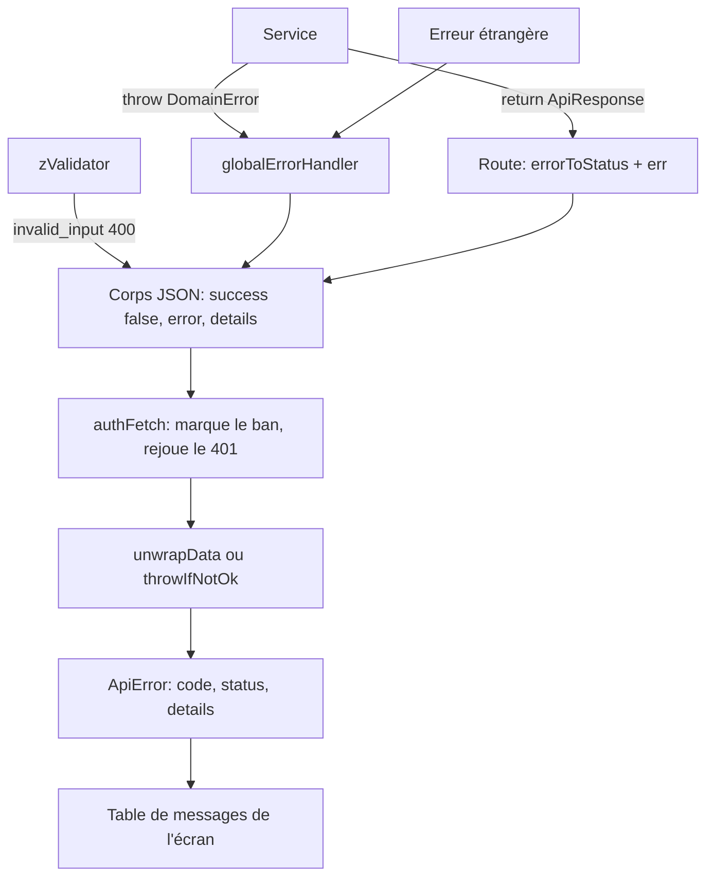

# Gestion des erreurs

Décision : [ADR 0007](../adr/0007-error-handling-strategy.md). Ce document possède le contrat
backend et wire, et raconte le trajet complet d'une erreur, du service jusqu'au texte affiché.

Le détail côté client n'est pas ici, il vit dans le code : `frontend/src/lib/queryClient.ts` pour
les erreurs de mutation et leur remontée à Faro, `frontend/src/component/Feedback/app/` pour les
boundaries React et l'écran d'erreur.

## Le trajet, en une image



**Quatre portes de sortie côté serveur, pas une seule.** C'est le point que la lecture du seul
handler global rate :

| Porte | Qui décide du statut | Passe par le handler global ? |
|---|---|---|
| Validation Zod (`backend/src/utils/validator.ts`) | 400 écrit en dur, code `invalid_input` | **Non**, le hook répond lui-même |
| `throw` d'une `DomainError` | `errorToStatus(code, thrownDomainErrorMapping)` | Oui |
| `return` d'une `ApiResponse` | la route, avec `errorToStatus(result.error, xxxErrorMapping)` | Non |
| Erreur étrangère | son propre champ `status` s'il existe, sinon 500 | Oui |

La validation Zod est la source principale des 400 de l'API. Elle ne traverse jamais le handler
global : inutile d'y chercher pourquoi un formulaire renvoie `invalid_input`.

## Un cas complet, du `throw` à l'écran

Création d'un produit déjà présent au catalogue.

1. **Service** : `createProduct`, dans `backend/src/features/products/write.service.ts`
   ```ts
   throw new ProductError('product_already_exists', { publicDetails: existing })
   ```
   `existing` est la ligne trouvée (`id`, `slug`, `name`, `brand`, `kind`).
2. **Transaction** : l'erreur remonte dans `withRlsContext`, qui annule la transaction de requête.
3. **Handler** : `error-handler.ts` reconnaît une `DomainError`, cherche le code dans
   `thrownDomainErrorMapping`, trouve `product_already_exists: CONFLICT` (`shared/src/products/helpers.ts`),
   répond **409**. Aucun log : les 4xx de domaine sont silencieux par choix.
4. **Sur le fil** :
   ```json
   { "success": false, "error": "product_already_exists",
     "details": { "id": "…", "slug": "…", "name": "…", "brand": "…", "kind": "…" } }
   ```
5. **Client** : `unwrapData` passe par `throwIfNotOk`, qui lit le corps d'erreur et jette
   `ApiError('product_already_exists', 409, details)`. Un 409 n'est jamais rejoué.
6. **Écran** : `useProductFormSubmit` appelle `extractFormError`, qui trouve l'entrée dans
   `ProductForm/formErrors.ts` et affiche **« Un produit avec ce nom et cette marque existe déjà. »**
   sous le champ Nom, pas en bandeau.

Les `details` publics fabriqués à l'étape 1 ne sont pas affichés sur ce chemin : l'écran de doublon
vient d'une pré-vérification dédiée. Un `publicDetails` ne sert que si une UI le consomme
vraiment.

## Ce que j'écris, selon le cas

- **Un échec métier, et l'appelant n'a rien à récupérer du chemin heureux** : `throw new XxxError(code)`
  depuis le service. C'est le cas par défaut, celui de tout le CRUD.
- **Le service doit rendre une valeur au succès et distinguer des branches attendues** : retourne
  une `ApiResponse`. La route narrow avec `isApiSuccess`, puis
  `c.json(err(result.error), errorToStatus(result.error, xxxErrorMapping))`. C'est le cas de l'auth
  (un mot de passe faux n'est pas un incident) et de plusieurs flux d'administration.
- **Une erreur d'infrastructure que je sais traduire** (violation d'unicité, appel externe) :
  `catch`, reconnais **le seul cas attendu**, jette un code de domaine, **relance tout le reste**.
  Helper : `translateUniqueViolation` (`backend/src/lib/catalog.ts`).
- **Jamais** : avaler une erreur SQL et continuer sur la même transaction. Elle est déjà avortée, la
  suite échouera ou committera un état faux.

La règle simple qui remplace « ne pas mélanger les styles » : **une branche attendue se retourne,
un échec d'infrastructure se relance.** Un même service peut légitimement faire les deux, et
`admin/moderation.service.ts` le fait avec la raison écrite sur place.

## Contrat wire

`shared/src/core/constants.ts` définit les deux seules enveloppes JSON :

```ts
type ApiSuccess<T> = { success: true; data: T; message?: string }
type ApiFailure<E extends string = string, D = unknown> = { success: false; error: E; details?: D }
```

Toujours passer par `ok(data)` et `err(code, details)`, jamais par un littéral.

- Le **code** est le contrat machine, stable. Ne jamais décider sur un message.
- `publicDetails` devient `details` et traverse le réseau. Rien d'autre ne traverse.
- `cause` reste serveur, dans la chaîne native de `Error`, pour les logs.
- Ni SQL, ni payload de fournisseur, ni jeton, ni identifiant interne dans `publicDetails`.

Attention : sur une `DomainError`, **`message` vaut le code** (`super(code, { cause })`). Il n'y a pas de message de
présentation côté backend : les textes utilisateur vivent dans le frontend, par code.

## Statuts

`baseErrorMapping` porte les sept codes transverses : `invalid_input` 400, `unauthorized` 401,
`forbidden` 403, `not_found` 404, `rate_limit_exceeded` 429, `server_error` 500, `http_error` 500.

Un domaine déclare son `xxxErrorMapping` à côté de son union de codes, dans
`shared/src/<domaine>/`. Le mapping est **indexé par code du wire**, jamais par nom de classe :
renommer une classe backend ne change pas le contrat HTTP.

**Piège** : pour qu'un code jeté soit mappé, son mapping doit être ajouté **à la main** dans
`thrownDomainErrorMappingRegistry` (`backend/src/utils/errors/error-handler.ts`). La table fusionnée est
typée `Record<string, HttpStatus>`, donc un oubli ne casse pas la compilation : le code sort en
**500 silencieux**. Le test d'exhaustivité de `error-handler.test.ts` rattrape cet oubli : tout nouveau
`xxxErrorMapping` exporté par `shared` doit être composé, ou classé explicitement parmi les mappings
sérialisés en route.

## Transactions

`withRlsContext` ouvre une transaction pour les requêtes **authentifiées** seulement, et annule
quand :

```ts
if (c.error || c.res.status >= 400)
```

Deux conséquences que la lecture naïve rate :

- il n'est **pas nécessaire de lever** pour annuler : une route qui retourne proprement un 404
  annule aussi les écritures réussies plus tôt dans la même requête ;
- une requête anonyme n'a pas de transaction du tout, donc rien à annuler.

Une écriture best-effort qui doit survivre à l'échec de la requête (audit, journal de sécurité)
passe par la connexion de base hors transaction, jamais par `requestDb`.

## Logs et incidents

- `DomainError` avec un statut < 500 : **aucun log**. C'est voulu, ce sont des branches de contrat.
- `DomainError` >= 500 : `logger.error` avec le code et le contexte de requête.
- Erreur étrangère portant un `status` : `info` sous 500, `error` au-dessus. Son message n'est
  renvoyé au client **qu'en développement**.
- Erreur inconnue : span OTel marqué, `logger.error`, `server_error` 500, stack en développement
  seulement.

## Côté client, l'essentiel

- `authFetch` est le seul intercepteur : sur 403 il marque le bannissement, sur 401 il tente un
  refresh et rejoue. **Il est neutralisé en SSR.**
- `unwrapData` (réponse enveloppée) et `throwIfNotOk` (204, blob, corps sans enveloppe) produisent
  une `ApiError` : `code`, `status`, `details`. Comme côté backend, `ApiError.message` vaut le code.
- Un corps illisible devient `ApiError('http_error', status)`. Ne jamais inventer un code de repli
  local, ne jamais `throw new Error(message)` après `!res.ok` : cela perd code, statut et détails.
- `ApiError.details` reste `unknown` : ce qui vient du réseau n'est pas une preuve de type.
- Retry : aucun sur une `ApiError` 4xx, un seul essai supplémentaire sinon. Les mutations ne sont
  jamais rejouées.
- Toute mutation a une `mutationKey` stable. Faro reçoit cette clé, plus le code et le statut des
  `ApiError`. `handledErrorCodes` exclut seulement les codes que l'écran traite explicitement ;
  les quatre codes 429 et `banned` sont exclus globalement. Les autres 4xx, les 5xx et les erreurs
  réseau restent capturés.
- La présentation est locale à l'écran : une table code vers message, plus un repli neutre.

## Écarts connus

Le contrat ci-dessus décrit la cible. Ces endroits n'y sont pas encore, et le savoir évite de
prendre un contre-exemple pour la règle :

| Écart | Où | Effet |
|---|---|---|
| Toute erreur convertie en un code métier | `features/blog/service.ts` (`article_delete_failed`) | Une panne DB devient un échec fonctionnel |
| `Error` nue jetée | `features/auth/refresh-token.service.ts` | Sort en `server_error` 500 |
| Code hors mapping, statut en dur | `features/health/routes.ts` (`db_unreachable`, 503) | Code inconnu du contrat |
| Enveloppe construite à la main | `features/security/security.middleware.ts` | Forme correcte, mais contourne `err()` |
| La probe d'auth jette une `Error` nue | `frontend/src/lib/queries/auth.ts` | Volontaire, mais `isApiError` est faux, statut et code perdus |
| Upload d'image en XHR brut | `frontend/src/component/ImageUpload/useImageUpload.ts` | Hors `authFetch` et hors `ApiError` : rejoue son propre 401, a sa propre table de messages |

## Ajouter un code d'erreur

1. Déclarer le code, et le type de ses détails publics, dans `shared/src/<domaine>/`.
2. Déclarer le mapping HTTP à côté de ce contrat.
3. Choisir : `throw` d'une sous-classe de `DomainError`, ou `ApiResponse` retournée (voir plus haut).
4. Si le code est jeté et n'est pas transverse, **l'ajouter à `thrownDomainErrorMappingRegistry`**. Le test
   d'exhaustivité du handler échoue sinon.
5. Côté écran, ajouter le message dans la table de l'écran concerné.
6. Tester le statut, le code et le contenu de `details`.
7. Tester que la `cause` et les données privées **n'apparaissent pas** dans la réponse.
